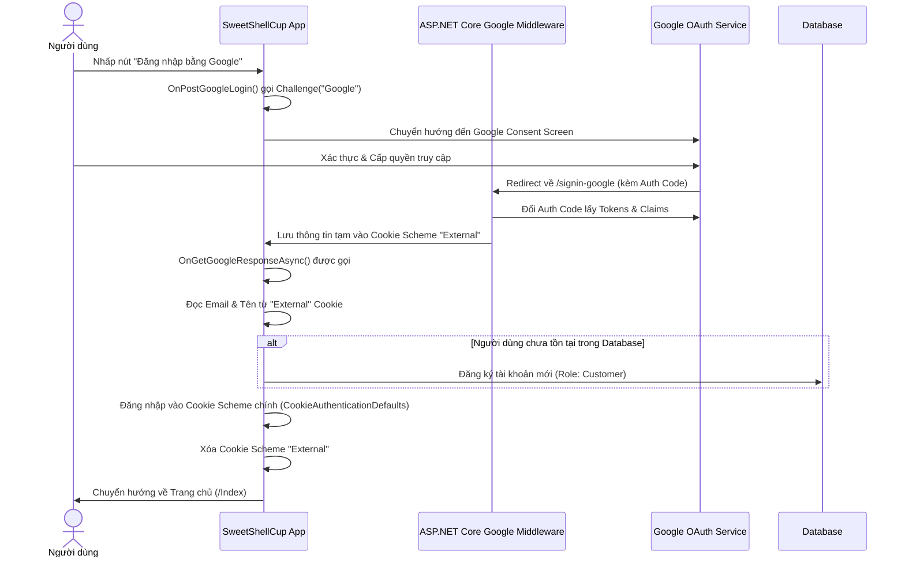

# Hướng Dẫn Cấu Hình và Sử Dụng Đăng Nhập Với Google (Google OAuth2)

Tài liệu này hướng dẫn cách cấu hình, thiết lập Google Cloud Console, và cơ chế hoạt động của tính năng Đăng nhập bằng Google trong dự án **SweetShellCup**.

---

## 1. Cơ Chế Hoạt Động (Workflow)

Hệ thống đăng nhập bằng Google trong SweetShellCup được cài đặt dựa trên Middleware của ASP.NET Core (`Microsoft.AspNetCore.Authentication.Google`) phối hợp với Cookie Authentication.



### Các Thành Phần Code Quan Trọng:
1. **Cấu hình dịch vụ (`Program.cs`)**:
   Dòng [Program.cs:13-26](file:///d:/ki%208%20_FPT/EXE201/SweetShellCup/SweetShellCup_Project/SweetShellCup/Program.cs#L13-L26) cấu hình dịch vụ Authentication:
   - Sử dụng cookie chính (`CookieAuthenticationDefaults.AuthenticationScheme`) để duy trì trạng thái đăng nhập.
   - Thêm một cookie phụ `"External"` làm nơi lưu trữ tạm thông tin do Google trả về trước khi đối chiếu với cơ sở dữ liệu.
   - Cấu hình OAuth Google bằng cách nạp ClientId và ClientSecret từ cấu hình.
2. **Xử lý đăng nhập (`Login.cshtml.cs`)**:
   Dòng [Login.cshtml.cs:61-113](file:///d:/ki%208%20_FPT/EXE201/SweetShellCup/SweetShellCup_Project/SweetShellCup/Pages/Auth/Login.cshtml.cs#L61-L113) chứa các handler:
   - `OnPostGoogleLogin`: Khởi chạy quy trình Challenge yêu cầu đăng nhập Google.
   - `OnGetGoogleResponseAsync`: Nhận kết quả từ Google, kiểm tra email trong CSDL (qua `IUserRepository`), tự động tạo tài khoản khách hàng mới nếu email chưa tồn tại, sau đó đăng nhập và xóa cookie tạm `"External"`.

---

## 2. Các Bước Thiết Lập Trên Google Cloud Console

Để có được Client ID và Client Secret cho ứng dụng, bạn cần làm theo các bước sau:

### Bước 2.1: Tạo Project trên Google Cloud Console
1. Truy cập vào [Google Cloud Console](https://console.cloud.google.com/).
2. Đăng nhập bằng tài khoản Google của bạn.
3. Nhấp vào danh sách dự án ở góc trên cùng bên trái và chọn **New Project** (Dự án mới).
4. Đặt tên cho dự án (ví dụ: `SweetShellCup`) và nhấn **Create** (Tạo).

### Bước 2.2: Cấu hình Màn hình Đồng ý OAuth (OAuth Consent Screen)
Trước khi tạo Credentials, bạn cần định nghĩa màn hình xin cấp quyền:
1. Tại menu bên trái, chọn **APIs & Services** > **OAuth consent screen**.
2. Chọn **User Type** là **External** (cho phép bất kỳ tài khoản Google nào cũng có thể đăng nhập) rồi nhấn **Create**.
3. Điền các thông tin bắt buộc:
   - **App name**: `Sweet Shell Cup`
   - **User support email**: Chọn email của bạn.
   - **Developer contact information**: Điền email của bạn.
4. Nhấn **Save and Continue** (Lưu và tiếp tục).
5. **Scopes (Phạm vi)**: Nhấn **Add or Remove Scopes**, tìm và chọn các quyền sau:
   - `.../auth/userinfo.email` (Xem địa chỉ email của bạn)
   - `.../auth/userinfo.profile` (Xem thông tin cá nhân cơ bản của bạn)
   - `openid` (Xác thực thông qua OpenID Connect)
   Nhấn **Update** ở cuối bảng điều khiển rồi chọn **Save and Continue**.
6. **Test Users**: Nhấp **Add Users** và thêm các email Google mà bạn muốn dùng để test khi ứng dụng đang ở chế độ thử nghiệm (Testing). Sau đó nhấn **Save and Continue**.

### Bước 2.3: Tạo OAuth Credentials (Client ID & Client Secret)
1. Ở menu bên trái, chọn **APIs & Services** > **Credentials**.
2. Nhấn vào **+ Create Credentials** ở đầu trang và chọn **OAuth client ID**.
3. Chọn **Application type** là **Web application**.
4. Điền tên cấu hình (ví dụ: `SweetShellCup Web Client`).
5. Cấu hình **Authorized JavaScript origins** (Nguồn gốc JavaScript được ủy quyền) cho môi trường local:
   - `https://localhost:7140`
   - `https://localhost:44323` (Nếu dùng IIS Express)
6. Cấu hình **Authorized redirect URIs** (URI chuyển hướng được ủy quyền):
   > [!IMPORTANT]
   > Đây là đường dẫn mà Google sẽ chuyển hướng về sau khi người dùng xác thực thành công. Với ASP.NET Core, đường dẫn mặc định luôn là `/signin-google`. Bạn phải điền chính xác:
   - `https://localhost:7140/signin-google`
   - `https://localhost:44323/signin-google` (Nếu dùng IIS Express)
   - Đối với môi trường triển khai thực tế (Production), hãy thêm: `https://<ten-mien-cua-ban>.onrender.com/signin-google`.
7. Nhấn **Create** (Tạo).
8. Một cửa sổ hiện lên chứa **Your Client ID** và **Your Client Secret**. Hãy sao chép lại hai giá trị này.

---

## 3. Cấu Hình Thông Tin Vào Dự Án

Có hai cách để cấu hình Client ID và Client Secret vào dự án:

### Cách 1: Sử dụng Secret Manager (Khuyên dùng khi Dev local)
Để tránh lộ thông tin bảo mật khi đẩy code lên Git, bạn nên lưu secrets ở ngoài thư mục dự án bằng công cụ `dotnet user-secrets`.

Mở terminal tại thư mục dự án `SweetShellCup` và chạy các lệnh sau:
```bash
# Khởi tạo User Secrets cho dự án
dotnet user-secrets init --project SweetShellCup

# Cấu hình ClientId
dotnet user-secrets set "Authentication:Google:ClientId" "YOUR_CLIENT_ID_COPIED" --project SweetShellCup

# Cấu hình ClientSecret
dotnet user-secrets set "Authentication:Google:ClientSecret" "YOUR_CLIENT_SECRET_COPIED" --project SweetShellCup
```

### Cách 2: Cấu hình trực tiếp trong `appsettings.json`
Nếu phát triển cá nhân hoặc trong môi trường an toàn, bạn có thể chỉnh sửa trực tiếp file [appsettings.json](file:///d:/ki%208%20_FPT/EXE201/SweetShellCup/SweetShellCup_Project/SweetShellCup/appsettings.json):
```json
  "Authentication": {
    "Google": {
      "ClientId": "YOUR_CLIENT_ID_COPIED.apps.googleusercontent.com",
      "ClientSecret": "YOUR_CLIENT_SECRET_COPIED"
    }
  }
```

### Cách 3: Cấu hình trên môi trường Production (như Render, Azure, v.v.)
Khi triển khai ứng dụng lên server (ví dụ: Render), tuyệt đối không lưu credentials trong file code hay file json. Hãy cấu hình chúng dưới dạng **Environment Variables** (Biến môi trường) trên giao diện điều khiển của Host:
- Tên biến 1: `Authentication__Google__ClientId`
- Giá trị: `<Client ID của bạn>`
- Tên biến 2: `Authentication__Google__ClientSecret`
- Giá trị: `<Client Secret của bạn>`

> [!TIP]
> Lưu ý dấu gạch dưới kép (`__`) trong tên biến môi trường đại diện cho dấu hai chấm (`:`) trong cấu hình JSON của ASP.NET Core.

---

## 4. Kiểm Tra Tính Năng (Testing)

1. Đảm bảo cổng chạy HTTPS của bạn trùng khớp với cổng đã đăng ký ở bước 2.3 (Ví dụ: `https://localhost:7140`).
2. Khởi chạy ứng dụng:
   ```bash
   dotnet run --project SweetShellCup
   ```
3. Truy cập đường dẫn đăng nhập: `https://localhost:7140/Auth/Login`.
4. Nhấn nút **Đăng nhập bằng Google**.
5. Đăng nhập bằng tài khoản Google đã cấu hình trong phần *Test Users* (nếu App ở trạng thái Testing).
6. Sau khi cấp quyền thành công, trình duyệt sẽ tự động quay trở về ứng dụng và bạn sẽ ở trạng thái đã đăng nhập.
7. Kiểm tra cơ sở dữ liệu bảng `Users`: Một tài khoản mới sẽ tự động được tạo với thông tin từ tài khoản Google của bạn (nếu email đó chưa đăng ký trước đây).
