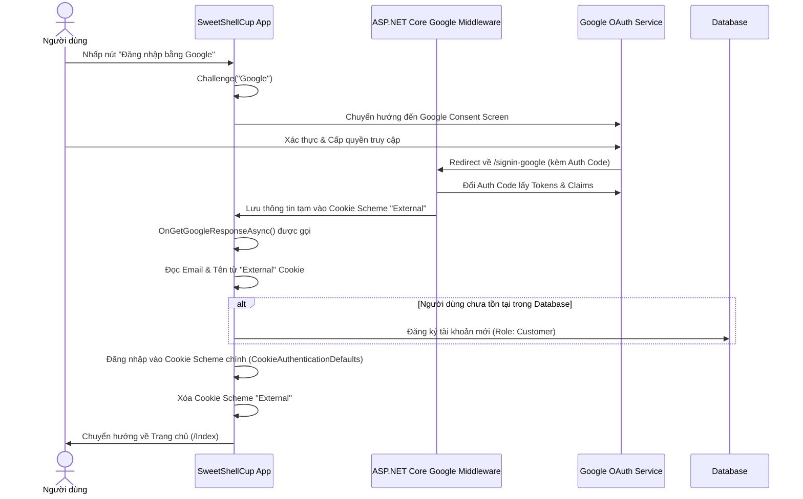

# Tổng Quan Dự Án Sweet Shell Cup

Tài liệu này cung cấp cái nhìn toàn cảnh về dự án **Sweet Shell Cup** (Cửa hàng kinh doanh cốc waffle ăn được), bao gồm cấu trúc dự án, công nghệ sử dụng, hạ tầng triển khai, và các luồng nghiệp vụ chính.

---

## 1. Giới Thiệu Dự Án

**Sweet Shell Cup** là một ứng dụng web thương mại điện tử nhằm kinh doanh sản phẩm cốc ăn được (waffle cup) độc đáo tại Việt Nam. Vừa giúp giảm thiểu rác thải nhựa, vừa tạo trải nghiệm ăn uống thú vị cho khách hàng. Hệ thống hỗ trợ mua sắm trực tuyến, tích hợp trí tuệ nhân tạo (AI Chatbot) để tư vấn khách hàng thời gian thực, quản lý đơn hàng và đăng nhập bảo mật qua Google.

---

## 2. Công Cụ & Công Nghệ Sử Dụng (Tech Stack)

Dự án được phân chia thành hai phần chính: Hệ thống web chạy thực tế (ASP.NET Core Razor Pages) và bản thử nghiệm giao diện (Prototype frontend).

### A. Hệ Thống Web Thực Tế (SweetShellCup Project)
*   **Framework chính:** `.NET 8.0` (ASP.NET Core Razor Pages).
*   **Cơ sở dữ liệu (Database):**
    *   **MySQL** (chạy trên Production & Local) thông qua nhà cung cấp `Pomelo.EntityFrameworkCore.MySql`.
    *   **SQL Server** (cấu hình dự phòng local) thông qua `Microsoft.EntityFrameworkCore.SqlServer`.
*   **Công cụ ORM:** Entity Framework Core (EF Core) sử dụng phương pháp **Code-First** để quản lý cơ sở dữ liệu qua Migrations.
*   **Giao diện & Styling:**
    *   Sử dụng HTML5 ngữ nghĩa và **Vanilla CSS** (`wwwroot/css/site.css`) để thiết kế giao diện tùy biến, kết hợp hiệu ứng CSS Isolation (`SweetShellCup.styles.css`).
    *   Font chữ hiện đại: **Work Sans** lấy từ Google Fonts.
    *   JavaScript thuần để xử lý logic phía client (như gọi API giỏ hàng, cập nhật số lượng, hiển thị chat popup).
*   **Bảo mật & Xác thực (Authentication):**
    *   `Cookie Authentication` làm cơ chế quản lý phiên làm việc (Session/Cookies).
    *   `Microsoft.AspNetCore.Authentication.Google` để tích hợp đăng nhập qua **Google OAuth 2.0**.
*   **Tích hợp bên thứ ba:**
    *   **AI Chat Service (Groq API):** Sử dụng endpoint của Groq API tích hợp mô hình ngôn ngữ lớn `llama-3.3-70b-versatile` để làm trợ lý ảo tự động tư vấn sản phẩm thời gian thực.
    *   **Email Service (SMTP Client):** Sử dụng tài khoản Gmail gửi mã OTP xác minh đăng ký tài khoản và khôi phục mật khẩu.

### B. Bản Thử Nghiệm Giao Diện (Layout/Create full prototype)
*   **Framework:** `React 18.3.1`, `Vite` và `TypeScript`.
*   **Thư viện Styling:** `Tailwind CSS 4.1.12`.
*   **Điều hướng:** `React Router 7.13.0`.
*   *Mục đích:* Dùng để demo, kiểm thử giao diện người dùng (UI/UX) độc lập trước khi chuyển giao diện sang các file `.cshtml` của ASP.NET Core.

---

## 3. Hạ Tầng & Triển Khai (Deployment)

Dự án hiện tại đã gỡ bỏ hoàn toàn Docker để tối ưu dung lượng và được cấu hình để triển khai trực tiếp lên **Railway**:

*   **Hệ thống Build & Deploy (Nixpacks):**
    *   Railway sử dụng **Nixpacks** để tự động nhận diện dự án C# / .NET 8.0, tự động tải các SDK cần thiết, chạy lệnh biên dịch `dotnet publish` và khởi chạy web.
    *   Ứng dụng lắng nghe và phục vụ trên cổng mạng động do Railway cấp phát (qua biến môi trường `ASPNETCORE_URLS=http://0.0.0.0:${PORT}`).
*   **Nền tảng Cloud (Hosting):** Triển khai trực tiếp lên **Railway** (dưới dạng một Web Service).
*   **Cơ sở dữ liệu (Cloud DB):** Sử dụng **Railway MySQL** (chạy trực tiếp trên cụm máy chủ của Railway).
*   **Cơ chế liên kết và cấu hình động:**
    *   Trong [Program.cs](file:///d:/ki%208%20_FPT/EXE201/SweetShellCup/SweetShellCup_Project/SweetShellCup/Program.cs), ứng dụng tự động kiểm tra các biến môi trường MySQL của Railway như `MYSQLHOST`, `MYSQLPORT`, `MYSQLUSER`, `MYSQLPASSWORD`, `MYSQLDATABASE` để tự dựng chuỗi kết nối.
    *   Nếu không có các biến này, hệ thống sẽ kiểm tra biến `MYSQL_URL` hoặc `DATABASE_URL` dạng `mysql://` và phân tích tự động.
    *   Nếu chạy local mà không có biến môi trường, ứng dụng sẽ dùng chuỗi kết nối mặc định `MyCnn` trong cấu hình `appsettings.json`.
    *   Các thông tin nhạy cảm khác như cấu hình đăng nhập Google OAuth, email SMTP và AI Chatbot được truyền qua **Variables** (Biến môi trường) trên trang quản trị Railway.

---

## 4. Các Luồng Nghiệp Vụ Chính (Project Workflows)

### A. Luồng Đăng Ký & Xác Thực (Registration & Auth Flow)
1.  **Đăng ký tài khoản mới:** Người dùng nhập thông tin -> Hệ thống tạo mã OTP -> Gọi [EmailService](file:///d:/ki%208%20_FPT/EXE201/SweetShellCup/SweetShellCup_Project/SweetShellCup/Services/EmailService.cs) gửi OTP về email -> Người dùng xác thực mã OTP -> Tài khoản chính thức được kích hoạt trong bảng `Users` với Role mặc định là `Customer`.
2.  **Đăng nhập bằng Google:**
    *   Người dùng click "Đăng nhập bằng Google".
    *   Hệ thống gọi Challenge và chuyển hướng sang màn hình đồng ý của Google.
    *   Người dùng đăng nhập và cấp quyền -> Google chuyển hướng về `/signin-google` trên web.
    *   Middleware lưu thông tin tạm thời vào cookie `"External"`.
    *   Hệ thống gọi handler `OnGetGoogleResponseAsync` kiểm tra xem email của Google đã tồn tại trong CSDL chưa. 
        *   Nếu chưa: Tự động đăng ký tài khoản khách hàng mới với email đó.
        *   Nếu rồi: Bỏ qua bước đăng ký.
    *   Hệ thống đăng nhập người dùng bằng cookie chính (`CookieAuthenticationDefaults`), xóa cookie tạm `"External"` và chuyển hướng về Trang chủ.

### B. Luồng Mua Sắm & Đặt Hàng (Shopping & Checkout Flow)
1.  **Xem sản phẩm:** Người dùng truy cập trang `/Shop/Index` để duyệt danh sách sản phẩm, lọc theo danh mục hoặc tìm kiếm theo tên.
2.  **Xem chi tiết:** Người dùng nhấp xem chi tiết tại `/Shop/Detail?id=...`, đọc thông tin chi tiết, hương vị, kích thước, thành phần và xem các đánh giá từ người mua trước.
3.  **Quản lý giỏ hàng:** Người dùng thêm sản phẩm vào giỏ hàng. Thông tin giỏ hàng được lưu trữ trực tiếp trong CSDL qua [CartRepository](file:///d:/ki%208%20_FPT/EXE201/SweetShellCup/SweetShellCup_Project/SweetShellCup/Repositories/CartRepository.cs) gắn với `UserId` của khách hàng. Khách hàng có thể tăng/giảm số lượng hoặc xóa sản phẩm khỏi giỏ hàng.
4.  **Đặt hàng & Thanh toán (Checkout):**
    *   Tại trang `/Cart/Index`, người dùng nhập địa chỉ giao hàng và số điện thoại, đồng thời chọn phương thức thanh toán (COD hoặc chuyển khoản ngân hàng).
    *   Khi click "Đặt hàng", hệ thống gọi handler `OnPostCheckoutAsync` tạo đơn hàng (`Order`) mới trong cơ sở dữ liệu với trạng thái `"Pending"`, tạo bản ghi thông tin thanh toán (`Payment`) tương ứng, sau đó dọn sạch giỏ hàng hiện tại.
    *   Hệ thống chuyển hướng người dùng tới trang thông tin chi tiết đơn hàng `/Customer/Orders/Details?id=...` để hiển thị hóa đơn và hướng dẫn thanh toán.

### C. Luồng Tư Vấn Bằng AI Chat (AI Chatbot Support Flow)
1.  Người dùng gửi tin nhắn thông qua khung chat tại Trang chủ hoặc trang Hỗ trợ.
2.  Khung chat gửi yêu cầu AJAX lên Page Handler `OnPostChatAsync` tại [Index.cshtml.cs](file:///d:/ki%208%20_FPT/EXE201/SweetShellCup/SweetShellCup_Project/SweetShellCup/Pages/Index.cshtml.cs).
3.  Hệ thống gọi [AIChatService](file:///d:/ki%208%20_FPT/EXE201/SweetShellCup/SweetShellCup_Project/SweetShellCup/Services/AIChatService.cs):
    *   Truy vấn danh sách sản phẩm thời gian thực trong cơ sở dữ liệu.
    *   Truy vấn thống kê top hương vị cốc bán chạy nhất và top sản phẩm được mua nhiều nhất.
    *   Tự động xây dựng `System Prompt` động chứa các thông tin real-time này làm ngữ cảnh.
    *   Gửi toàn bộ ngữ cảnh cùng lịch sử trò chuyện qua API của Groq (`llama-3.3-70b-versatile`).
4.  Nhận phản hồi từ mô hình AI, định dạng lại nội dung dưới dạng HTML đơn giản và gửi ngược lại về giao diện người dùng.

### D. Luồng Quản Trị Hệ Thống (Admin Operations Flow)
1.  **Đăng nhập quyền Admin:** Tài khoản có Role là `Admin` sẽ hiển thị nút "Trang quản trị" trên thanh điều hướng.
2.  **Xem thống kê (Dashboard):** Xem tổng số lượng người dùng, sản phẩm, đơn hàng, tổng doanh thu và danh sách các giao dịch gần nhất tại `/Admin/Index`.
3.  **Quản lý danh mục & sản phẩm:** Thêm sản phẩm mới, chỉnh sửa thông tin, giá, hương vị, ảnh minh họa hoặc xóa sản phẩm.
4.  **Xử lý đơn hàng:** Xem danh sách đơn hàng của tất cả khách hàng. Cập nhật trạng thái đơn hàng (ví dụ từ `Pending` sang `Processing` -> `Shipping` -> `Completed`). 
    *   *Tính năng tự động:* Khi Admin cập nhật trạng thái đơn hàng thành `Completed`, hệ thống sẽ tự động cập nhật trạng thái thanh toán tương ứng sang `Paid` và ghi nhận thời gian thanh toán `PaidAt`.
